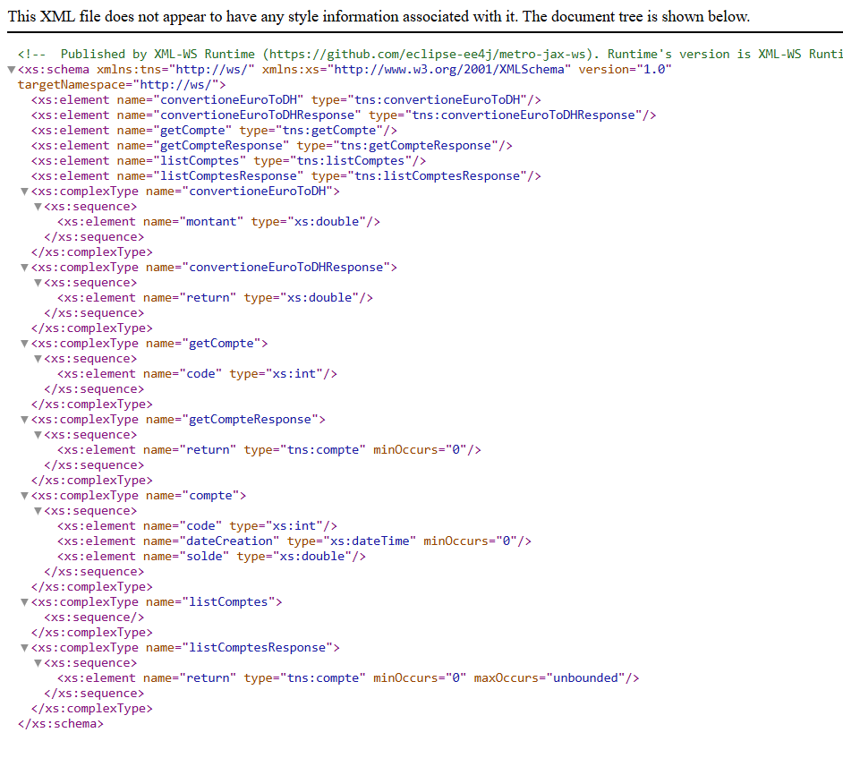
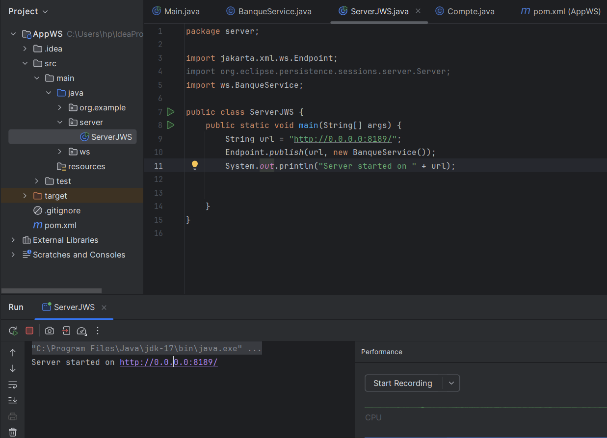
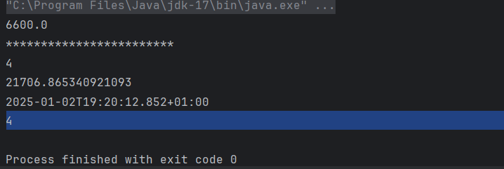
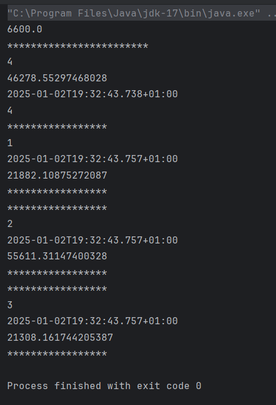
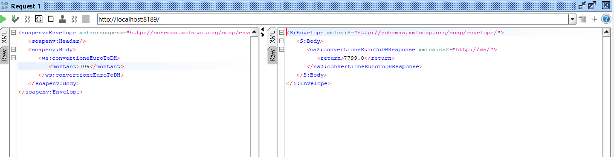
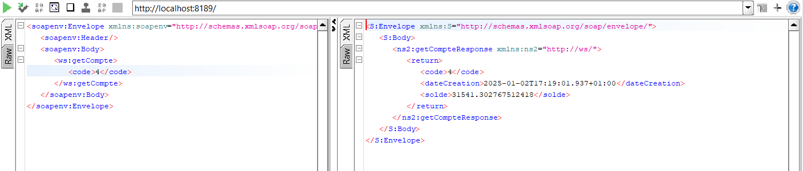
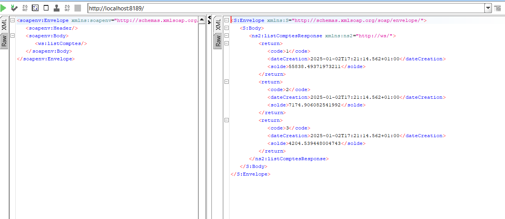
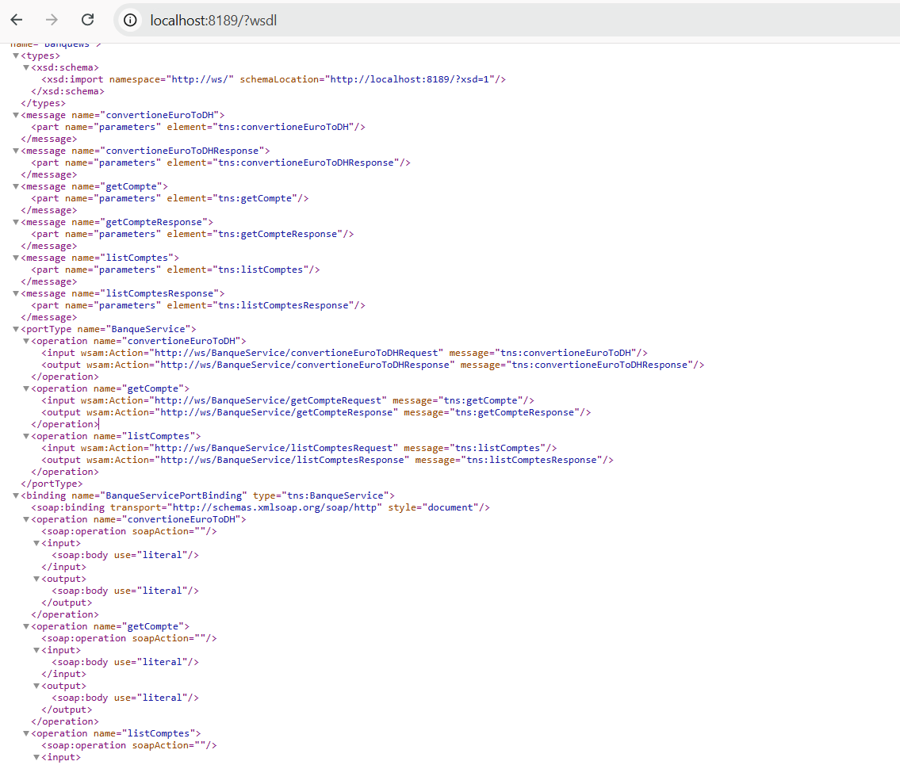

# Implémentation des Web Services SOAP WSDL avec JAX-WS

Ce projet illustre l'implémentation de services web SOAP utilisant **JAX-WS**. Il montre comment exposer et consommer des services en utilisant la spécification WSDL (Web Services Description Language).

## Fonctionnalités
- Création d'un service web SOAP en utilisant JAX-WS.
- Génération automatique de WSDL à partir du code.
- Déploiement d'un service web dans un environnement local.
- Exemple d'un client SOAP consommant le service.
- Documentation et gestion des exceptions SOAP.

## Technologies utilisées
- **Java** : Langage principal.
- **JAX-WS** : API pour les services web SOAP.
- **WSDL** : Description du service.
- **Apache Tomcat** : Serveur d'applications (ou tout autre serveur si applicable).
- **Maven** : Gestionnaire de dépendances.

## Installation et exécution

### Prérequis
- **Java JDK** (version 17 ou supérieure).
- Un serveur d'applications tel que **Apache Tomcat** ou **GlassFish**.
- **Maven** installé et configuré.

<h1>Captures</h1>

